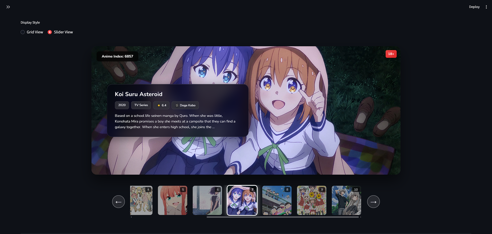

# 🎌 AiMi (愛視) - The Ultimate Anime AI Ecosystem

**AiMi** is a production-grade **Retrieval-Augmented Generation (RAG)** recommendation engine and viral **Anime Receipt Generator** built to revolutionize how we discover anime.

It moves beyond simple tag matching ("Action", "Romance") to understand complex semantic queries like *"Anime that feels like a warm hug"* or *"Cyberpunk with philosophical themes about identity."*

*The AiMi Dashboard featuring the immersive Slider View.*

-----

## 🚀 Features

### 🧠 The Recommendation Engine

* **Hybrid Search:** Combines **Nomic v1.5 Embeddings** (Vector Search) with **BM25** (Keyword Boosting) for maximum accuracy.
* **Hardware-Aware:** Automatically switches between **Lightweight Mode** (CPU) and **HyDE Generative Mode** (GPU) using Qwen-2.5-1.5B.
* **Semantic Understanding:** Translates user intent (e.g., "No ecchi" → "Wholesome, Family Friendly") before searching.

### 🎟️ The Receipt Generator

* Generates viral, two-sided aesthetic receipts of your watch history.
* **Tech Stack:** Playwright (Async Rendering) + Pillow.
* **Multi-Format:** Exports to Instagram (1080p), Twitter, and Premium High-Res.

  
  
  

-----

## 📂 The Data (108 Years of History)

The system is powered by a proprietary dataset spanning **1917 to 2025**.

* **8,248** Curated Anime
* **38** Rich Metadata Columns
* **RAG-Optimized** `canonical_embedding_text` fields

I have open-sourced a **500-row sample** for the community.
👉 **[Download the Sample Dataset on Kaggle](https://www.kaggle.com/datasets/divyanshusingh369/aimi-anime-rag-and-receipts-dataset-sample/data)**

-----

## 🛠️ Tech Stack

* **Backend:** FastAPI, Uvicorn, Pydantic
* **Frontend:** Streamlit (Custom CSS components)
* **Vector DB:** FAISS (CPU/GPU) & HNSW (macOS)
* **ML Ops:** PyTorch, Sentence-Transformers, Accelerate
* **Automation:** Playwright, AsyncIO

-----

## 💎 Get the Source Code

This is a **Source-Available** commercial product. It is designed for entrepreneurs and developers who want to launch their own Anime SaaS or learn advanced RAG architecture.

| Product | What You Get | Get It Here |
| :--- | :--- | :--- |
| **Tier 1** | **8,248 Anime Dataset (Parquet)** |  |
| **Tier 2** | **Full AiMi Recommendation System (Backend + UI)** |  |
| **Tier 3** | **Ultimate AiMi Recommendation System + AiMi Anime Receipts Generator** |  |

-----

## 📜 License

This software is **Commercial / Source-Available**.

* ✅ You **CAN** use it to build a commercial website/SaaS.
* ✅ You **CAN** modify the code for your projects.
* ❌ You **CANNOT** resell the raw source code or dataset.

> *Built with ❤️ by Divyanshu Singh*

-----

